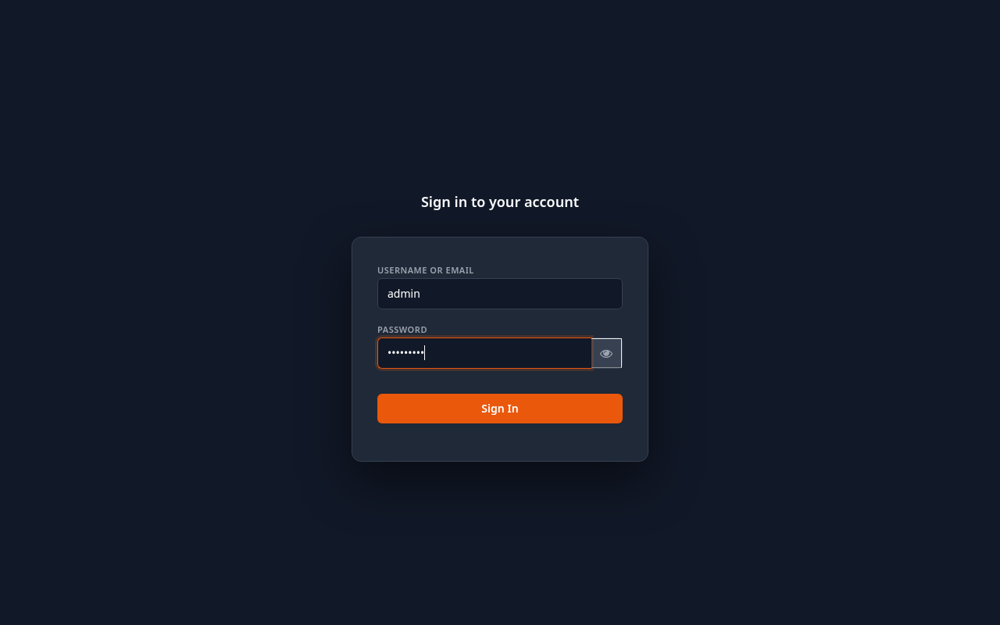

# Guide utilisateur — Gestion de Flotte

## Prérequis

- Minikube démarré (`minikube start`)
- Tous les pods en état Running (`kubectl get pods -n flotte-dev`)
- Entrées dans `/etc/hosts` :
  ```
  192.168.49.2  flotte.local api.flotte.local auth.flotte.local
  ```
- Chrome avec le flag activé : `chrome://flags/#unsafely-treat-insecure-origin-as-secure`
  (valeur : `http://flotte.local,http://auth.flotte.local`)

---

## 1. Connexion

Ouvrir `http://flotte.local` dans Chrome. L'application redirige automatiquement vers la page de connexion Keycloak.



Saisir les identifiants et cliquer sur **Se connecter**.

| Rôle | Identifiant | Mot de passe |
|------|-------------|--------------|
| Administrateur | admin | Admin123! |
| Manager | manager | Manager123! |
| Technicien | technicien | Technicien123! |
| Utilisateur | utilisateur | Utilisateur123! |

Après connexion, l'application affiche la page **Véhicules**.

---

## 2. Page Véhicules

**URL :** `http://flotte.local/` (page par défaut)

Affiche la liste complète du parc automobile avec pour chaque véhicule : immatriculation, marque, modèle, année, kilométrage et statut.

**Actions disponibles selon le rôle :**

- **Ajouter un véhicule** (admin, manager) : cliquer sur le bouton en haut à droite, remplir le formulaire (immatriculation, marque, modèle, année, kilométrage) et valider.
- **Modifier** (admin, manager) : cliquer sur l'icône de modification sur la ligne du véhicule.
- **Supprimer** (admin) : cliquer sur l'icône de suppression, confirmer dans la boîte de dialogue.

**Statuts possibles :** disponible, en_mission, en_maintenance, hors_service.

---

## 3. Page Conducteurs

**URL :** `http://flotte.local/conducteurs`

Liste tous les conducteurs avec leurs informations : nom, prénom, email, téléphone, numéro de permis, catégories de permis, date d'expiration et statut.

**Actions disponibles :**

- **Ajouter un conducteur** (admin, manager) : remplir nom, prénom, email, téléphone, numéro de permis, catégories et date d'expiration.
- **Modifier** (admin, manager) : modifier les informations d'un conducteur existant.
- **Supprimer** (admin) : suppression avec confirmation.

**Statuts possibles :** actif, inactif, en_mission, suspendu.

---

## 4. Page Maintenance

**URL :** `http://flotte.local/maintenance`

Gestion des interventions de maintenance planifiées et en cours sur les véhicules.

**Actions disponibles :**

- **Planifier une intervention** (admin, manager, technicien) : sélectionner le véhicule, le type d'intervention (révision, réparation, contrôle technique, pneus, autre), la date prévue, la description et le technicien responsable.
- **Modifier** : mettre à jour le statut (planifiée → en_cours → terminée), saisir la date réelle, le kilométrage et le coût.
- **Annuler** : passer une intervention en statut annulée.

**Cycle de vie d'une intervention :**

```
planifiee → en_cours → terminee
                    ↘ annulee
```

---

## 5. Page Alertes

**URL :** `http://flotte.local/alertes`

Affiche les alertes générées automatiquement par le système Kafka à chaque événement (création véhicule, assignation mission, intervention maintenance, violation géofencing).

**Fonctionnalités :**

- Filtre par niveau (info, warning, critique)
- Filtre non lues / toutes
- Cliquer sur **Marquer comme lu** pour acquitter une alerte

> Les alertes de niveau **critique** ne sont visibles que par les rôles admin et manager.

---

## 6. Page Carte GPS

**URL :** `http://flotte.local/carte`

Carte interactive (OpenStreetMap via Leaflet) affichant la position en temps réel de chaque véhicule actif.

**Fonctionnalités :**

- Rafraîchissement automatique toutes les 5 secondes
- Cliquer sur un marqueur pour voir : ID véhicule, latitude, longitude, heure de la dernière position
- Le nombre de véhicules en ligne est affiché dans le titre de la page

Pour alimenter la carte, lancer le simulateur GPS :

```bash
# Terminal 1
kubectl port-forward -n flotte-dev svc/svc-localisation 50051:50051

# Terminal 2
cd svc-localisation/simulateur
node simulateur.js
```

---

## 7. Déconnexion

Cliquer sur le bouton **Déconnexion** dans la barre de navigation en haut à droite. L'application redirige vers la page de connexion Keycloak.
